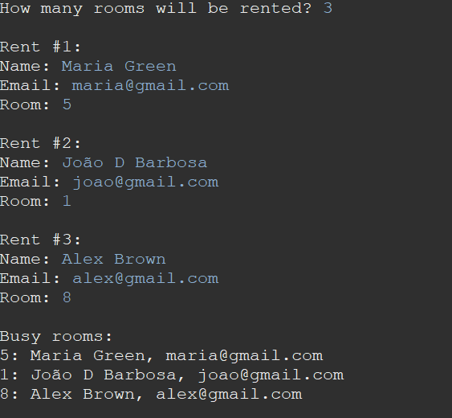

# Gerenciamento de Aluguel de Quartos em Pensionato. 👨🏿‍💻🏠

Projeto Java de gerenciamento de aluguel de quartos em um pensionato.

O projeto tem como objetivo simular o registro de aluguel desses quartos por estudantes.

## Sobre o Projeto

Este projeto oferece uma simulação simplificada de um sistema de gerenciamento de aluguel de quartos em um pensionato. Ele permite que os estudantes escolham um quarto disponível (números de 0 a 9) e registrem seus nomes e emails para ocupação. Importante ressaltar que o projeto não realiza a verificação da disponibilidade do quarto; trata-se de uma implementação básica para introduzir conceitos de programação Java.

## Funcionalidades

- Registro de aluguel de quartos por estudantes.
- Armazenamento de informações de ocupação, incluindo número do quarto, nome do estudante e email.
- Geração de um relatório de ocupações ao final do registro.

## Fluxo do Programa

1. **Inicialização:** O programa começa com todos os dez quartos vazios.

2. **Leitura do Número de Estudantes:** O programa lê um valor N que representa a quantidade de estudantes que irão alugar quartos. N pode variar de 1 a 10, devido à disponibilidade dos quartos.

3. **Registro de Aluguel:** O programa solicita os detalhes de cada estudante que irá alugar um quarto. Para cada estudante, são registrados o nome, o email e o número do quarto escolhido (de 0 a 9).

4. **Relatório de Ocupações:** Após o registro de todos os estudantes, o programa gera um relatório listando todas as ocupações do pensionato. Cada entrada do relatório inclui o número do quarto, o nome do estudante e o email do estudante.

5. **Finalização:** O programa é encerrado após a geração do relatório de ocupações.

## Como Usar

1. Clone este repositório para a sua máquina.
2. Compile e execute o programa Java.
3. Siga as instruções para cadastrar os estudantes e escolher os quartos.
4. O programa irá gerar um relatório de ocupações ao final.

## Pré-requisitos

- Java 11
- Qualquer IDE de desenvolvimento Java

## Captura de Tela

## Contribuição

Contribuições são bem-vindas! Se você encontrou algum problema ou deseja adicionar novas funcionalidades, fique à vontade para abrir uma issue ou enviar um pull request.

## Desenvolvedor

Este projeto foi desenvolvido como parte do meu aprendizado e prática em Java. 

\-- João Barbosa